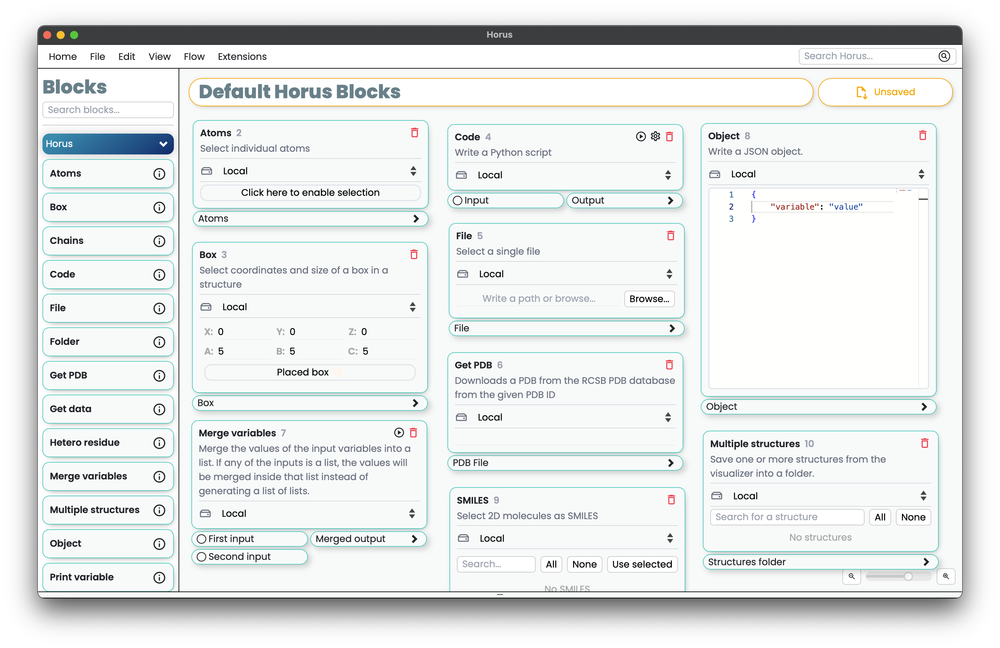

.. _default:

Default Horus Plugin
====================

The default Horus plugin implements common basic functionality such as getting data from a remote server,
visualizing molecules in Mol*, or giving input options to other blocks.

**************
Default blocks
**************

:bdg-secondary-line:`Horus` implements some useful blocks by default. These can be found under the "Horus" section of the :bdg-secondary-line:`Block` list.

******************
Default extensions
******************

Horus comes with a default :bdg-secondary-line:`Extension` used to load HTML files, images and more. This can be useful for loading simple reports of the calculations made by a :bdg-secondary-line:`Block`.
For example, one could load pandas dataframes, matplotlib plots, or even ipywidgets.

You can use the extension by calling the :bdg-secondary-line:`ExtensionsAPI` from inside a :bdg-secondary-line:`Block`. You can use its methods to load information into :bdg-secondary-line:`Horus`. For
more information about :bdg-secondary-line:`Extensions`, please refer to the :ref:`extensions` section.

All default extension functions provides optional parameters such as "title" and "store" for storing the result into the block.

.. code-block:: python

    from HorusAPI import Extensions, PluginBlock

    def myBlockAction(block: PluginBlock):
        from ipywidgets import IntSlider
        from ipywidgets.embed import embed_minimal_html

        slider = IntSlider(value=40)
        embed_minimal_html('export.html', views=[slider], title='Widgets export')

        # Load the html file as a string
        with open("export.html", "r") as f:
            html = f.read()

        Extensions().loadHTML(html, "My results")

loadHTML
--------

This extension loads an HTML file into the Horus extensions view. The file path should be provided, and the content is displayed as a rendered HTML document.

.. code-block:: python

    from HorusAPI import Extensions
    ext = Extensions()

    with open("path/to/file.html", "r") as f:
        ext.loadHTML(f.read(), title="Awsome page", store=False)

loadImage
---------

This extension loads and displays a single image from a specified image file path. Supported image formats include common types such as `.jpg`, `.png`, etc.

.. code-block:: python

    ext.loadImage("path/to/image.png", title="My dog.png", store=True)

loadText
--------

Use this extension to load and display formatted text. You can pass the text directly or read it from a file, making it useful for displaying log files, reports, or any text-based content.

.. code-block:: python

    with open("logfile.log", "r") as f:
        ext.loadText(f.read())

loadCSV
-------

This extension loads CSV data into an interactive table, allowing users to explore and manipulate the data. It requires a valid CSV file path.

.. code-block:: python

    ext.loadCSV("path/to/data.csv", store=True)

loadPlot
--------

This extension creates an interactive plot using CSV data. The CSV file should contain columns representing the data series to be plotted.

.. code-block:: python

    ext.loadPlot("path/to/plot_data.csv")

loadPDF
-------

This extension loads and displays a PDF file directly in the extensions view. It can handle multi-page PDFs and supports standard PDF navigation features.

.. code-block:: python

    ext.loadPDF("path/to/document.pdf", "Report")

loadFile
--------

This extension loads and displays the Horus File Editor with the content of a specified file.
It supports multiple text-based file formats and includes options for read-only access and syntax highlighting.
If no title is provided, the file name will be used as the title.
If no format is specified, it will be automatically inferred from the file extension.
The extension is intended primarily for text files (e.g., JSON, XML, source code). For images or PDFs, use the dedicated functions described above.

.. code-block:: python

    ext.loadFile("path/to/file.txt", title="My File", readOnly=False, format="text")

