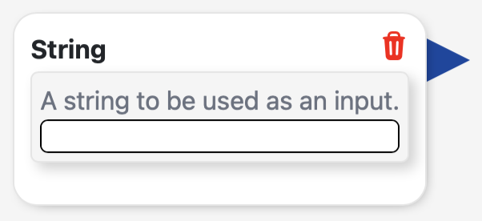
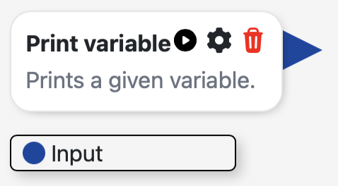
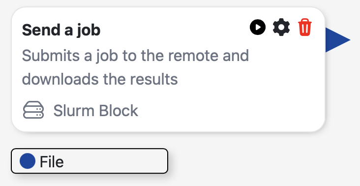

******
Blocks
******

Blocks are the most important part of the HorusAPI. :bdg-secondary-line:`Blocks` execute python code
based on the provided :bdg-secondary-line:`PluginVariable`. In order to build a :bdg-secondary-line:`Block`,
you first need to instantiate some :bdg-secondary-line:`PluginVariable` and define the :bdg-secondary-line:`Action`
that the block will perform.

Defining the Block
==================

The first step is to instantiate the :bdg-secondary-line:`Blocks` class. There are different kind of blocks depending on the :bdg-secondary-line:`Action` that they perform: 
Regular blocks (:bdg-secondary-line:`PluginBlock`), Input blocks (:bdg-secondary-line:`InputBlock`) and Slurm blocks (:bdg-secondary-line:`SlurmBlock`). 

.. autoclass:: src.PluginBlock

.. autoclass:: src.InputBlock

.. autoclass:: src.SlurmBlock

:bdg-secondary-line:`PluginBlock` is the most common block. It is used to execute a single python function that will be run locally
on the machine. :bdg-secondary-line:`InputBlock` only accepts a single :bdg-secondary-line:`PluginVariable` as input and are used to
pass data to the inputs of another :bdg-secondary-line:`PluginBlock` or :bdg-secondary-line:`SlurmBlock`. Finally, :bdg-secondary-line:`SlurmBlock`
executes two python functions, one before the job is sent to the a Slurm queue, and one after the job is finished.

Setting the action of the block
-------------------------------

The :bdg-secondary-line:`Action` of the block is defined as a python function. The function must always take the :bdg-secondary-line:`block` parameter with the respective :bdg-secondary-line:`PluginBlock` type.
If any error is raised past the :bdg-secondary-line:`Action` function scope, the block will be marked as failed and the error message will be displayed in the GUI as a pop-up alert.

Accessing variables
-------------------

In order to acces the updated variables coming from the flow within the :bdg-secondary-line:`Block` :bdg-secondary-line:`Action`,
do not use the :bdg-secondary-line:`PluginVariable` object, but rather the :bdg-secondary-line:`block.variables` dictionary. This dictionary
contains the updated values of the variables, and can be accessed using the :bdg-secondary-line:`PluginVariable` ID as the key. You can access three
different kind of variables: :bdg-secondary-line:`Variables`, :bdg-secondary-line:`Inputs` and :bdg-secondary-line:`Configs`.

.. code-block:: python

    def myCustomAction(block: PluginBlock):

        # The block passed to the function contains an updated dictionary of the variables
        # acces it using the variable id

        # Accessing variable value
        inputStringValue = block.variables["stringVariableID"]

        # Accessing input value
        inputFilePath = block.inputs["fileID"]

        # Accessing config value
        configValue = block.config["configID"]

        print(inputStringValue)

Setting outputs
---------------

If your :bdg-secondary-line:`Block` produces any output, you can set the value of the variable using the :bdg-secondary-line:`block.setOutput()`
method. As with the other variables, use the output variable ID.

.. code-block:: python

    def myCustomAction(block: PluginBlock):

        # Setting output value
        block.setOutput("outputVariableID", variableValue)

Examples
========

Input blocks
------------

As an example, here is the definition of an :bdg-secondary-line:`InputBlock` that simply passes a string to the next block:

.. code-block:: python

    from HorusAPI import PluginVariable, InputBlock, VariableTypes

    # First define the variable to be used in the block
    inputString = PluginVariable(
        name="String",
        id="string",
        description="A string to be used as an input.",
        type=VariableTypes.STRING,
    )

    # Then instantiate the block giving it a name, a description, the action to be performed and the variable.
    stringBlock = InputBlock(
        name="String",
        description="A string to be used as an input.",
        action=None,
        variable=inputString,
    )

As you see, if the input being passed does not required any preparation, the action can be defined as None.

Regular blocks
--------------

Here is an example of a :bdg-secondary-line:`PluginBlock` that simply prints the given input and sets it as its output:

.. code-block:: python

    from HorusAPI import PluginVariable, PluginBlock, VariableTypes

    # First define the variable to be used as input in the block
    inputVariable = PluginVariable(
        name="Input",
        id="inputID",
        description="A variable to be used as an input.",
        type=VariableTypes.ANY,
    )

    # Define also the output variable
    outputVariable = PluginVariable(
        name="Output variable",
        id="outputID",
        description="The same variable as the input.",
        type=VariableTypes.ANY,
    )

    # Then define the action that the block will perform
    def myCustomAction(block: PluginBlock):

        # The block passed to the function contains an updated dictionary of the variables
        # acces it using the variable id
        inputValue = block.inputs["inputID"]

        print(inputValue)

        block.setOutput("outputID", inputValue)

    # Finally, instantiate the block giving it a name, a description, the action to be performed and the variable.
    printVariableBlock = PluginBlock(
        name="Print variable",
        description="Prints a given variable.",
        action=myCustomAction,
        inputs=[inputVariable],
        outputs=[outputVariable],
    )

Slurm blocks
------------

Here is an example of a :bdg-secondary-line:`SlurmBlock` that uploads a file to a remote server before the job is sent to the Slurm queue
and downloads the result after the job is finished:

.. code-block:: python

    from HorusAPI import PluginVariable, SlurmBlock, VariableTypes

    # First define the input to be used in the block
    inputFile = PluginVariable(
        name="File",
        id="fileID",
        description="A file to upload to a remote server.",
        type=VariableTypes.FILE,
    )

    # Then define the output to be used in the block
    outputFile = PluginVariable(
        name="Output file",
        id="outputFile",
        description="The file downloaded from the remote server after the job is finished.",
        type=VariableTypes.FILE,
    )

    # You can also define a regular variable, which is independent of the inputs.
    # This variable will be available in the block configuration button.
    regularVariable = PluginVariable(
        name="Regular variable",
        id="regularVariable",
        description="A regular variable.",
        type=VariableTypes.STRING,
    )

    # Then define the action that the block will perform before the job is sent to the Slurm queue
    def myCustomActionBefore(block: SlurmBlock):
        # The block passed to the function contains an updated dictionary of the variables
        # acces it using the variable id either for the regular variables or the inputs.

        regularVariableValue = block.variables["regularVariable"]
        inputFilePath = block.inputs["fileID"]

        print("Regular variable value: ", regularVariableValue)

        # Upload the file to the remote server using the RemoteAPI
        block.remote.sendData(inputFilePath, "/path/in/remote/server")

        jobID = block.remote.submitJob("/path/in/remote/server")

        print("Job submitted with ID: ", jobID)

    # Then define the action that the block will perform after the job is finished
    def myCustomActionAfter(block: SlurmBlock):
        print("Job finished, downloading results...")

        # Download the results from the remote server using the RemoteAPI
        block.remote.getData("/path/in/remote/server", "/path/in/local/machine")

        # Set the output variable to the path of the downloaded file
        block.setOutput("outputFile", "/path/in/local/machine")

    # Finally, instantiate the block giving it a name, a description, the action to be performed and the variable.
    sendJobBlock = SlurmBlock(
        name="Send a job",
        description="Submits a job to the remote and downloads the results",
        initialAction=myCustomActionBefore,
        finalAction=myCustomActionAfter,
        variables=[regularVariable],
        inputs=[inputFile],
        outputs=[outputFile],
    )

Configurations
==============

You can add permanent variables to :bdg-secondary-line:`Block`. These variables are available for
modification under the Plugin's configuration button. The :bdg-secondary-line:`PluginConfig` class 
is just a subclass of :bdg-secondary-line:`PluginBlock`, so you can define also an action to be performed
when the configuration is modified.

Instantiate your PluginConfig as a regular :bdg-secondary-line:`PluginBlock` and then add it to the :bdg-secondary-line:`Block` using the
.addConfig() method.

.. code-block:: python

    myBlockThatNeedsConfig.addConfig(myConfig)

Then, the config can be accessed like the variables in the :bdg-secondary-line:`Block`'s action:

.. code-block:: python

    myConfigValue = block.config["myConfigID"]

Adding Blocks to a Plugin
=========================

Once you have defined several :bdg-secondary-line:`Block`, you can add them to your :bdg-secondary-line:`Plugin` using the
.addBlock() method:

.. code-block:: python

    plugin.addBlock(myBlock)

