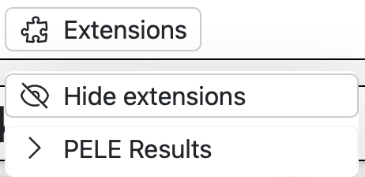

.. _extensions:

**********
Extensions
**********

Building an extension view
==========================

Extensions are embedded views coded in HTML, CSS and JavaScript. They can be used
to add new interfaces for interacting with the results of your blocks, for example.
In order to display the embedded view, you need to include the web files inside
the :bdg-secondary-line:`Pages` folder of your plugin:

.. code-block:: bash

    MyPlugin
    ├── Include/
    ├── deps/
    ├── Pages/ # Put here all your web files
    ├── plugin.meta
    └── main.py

This folder acts as the root of your web page.

PluginPage
----------

Extensions are built using the :bdg-secondary-line:`PluginPage` class.

.. autoclass:: src.PluginPage

PluginEndpoint
--------------

As you may have noticed, web pages need to contact the server through requests in order
to get data. This is done using the :bdg-secondary-line:`PluginEndpoint` class. 
Horus runs a background Flask server, therefore you can treat your extensions as
being part of a Flask app. The URL to send the requests to can be computed using the `window.location` value
due to the fact that extensions are running inside an iframe. For example:

.. code-block:: javascript

    const href = window.location.href;

    const postTo = href + "customEndpoint"; // This will be the correct URL to send the request to

.. autoclass:: src.PluginEndpoint

Adding views to your Plugin
===========================

Once you have defined your :bdg-secondary-line:`PluginPage` and :bdg-secondary-line:`PluginEndpoint` objects,
you can add them to your plugin using the :bdg-secondary-line:`addPage` method of the :bdg-secondary-line:`Plugin` class.

.. code-block:: python

    plugin.addPage(myCustomViewPage)

If the extension is correctly defined, you should be able to see it in the Extensions menu.

Examples
========

.. code-block:: python

    # Define a results page
    myCustomViewPage = PluginPage(
        id="customView",
        name="Custom view",
        description="View your results in a custom way",
        html="index.html", # The HTML file to load
    )

    # Define the endpoint function
    def customEndpointFunction():
        data = request.json

        if data is None:
            return {"ok": False, "msg": "No data provided."}

        print(data)

        return {"ok": True}

    # Add the endpoint to the PluginPage
    customEndpoint = PluginEndpoint(
        url="/customEndpoint",
        methods=["POST"],
        function=customEndpointFunction,
    )

    # Add the endpoint to the page
    myCustomViewPage.addEndpoint(customEndpoint)

Extensions class
----------------

Apart from opening the extensions view from the menu, you can also use the :bdg-secondary-line:`Extensions` class
to open the view directly from a :bdg-secondary-line:`Block` action. Using the :bdg-secondary-line:`open()` method you can pass
data to your extension that can be handled when loading the HTML. You will need
the ID of the plugin that provides the extension and the extension ID.

In your block's action:

.. code-block:: python

    from HorusAPI import Extensions

    # Open the extensions view
    Extensions().open(pluginID="mypluginid", pageID="customView", data={"someData": data})

You can also store the "result" inside the block that provided the data. This will display
an "Extensions" button in the block's view with the provided label. When clicked, the extension
will open with the provided data.

.. code-block:: python

    from HorusAPI import Extensions

    # Open the extensions view
    Extensions().storeExtensionResults(pluginID="mypluginid", pageID="customView", data={"someData": data}, title="View results")

You can access the data in JavaScript from the window object (or as the global `horus` variable) as follows:

.. code-block:: javascript

    // Get the data passed from the extension. The data gets automatically injected into the window object
    const data = window.extensionData;
    console.log(data.someData) // The object passed from the Extensions class

Using the File Picker inside an Extension
-----------------------------------------

You can call the Horus File Picker using the following JavaScript snippet:

.. code-block:: javascript
    
    window.horus.openExtensionFilePicker()

This will open the Desktop / Server File Picker accordingly. You can provide custom options in order to select folders,
allow only specific file extensions, or controlling what happens when the user selects a file:

.. code-block:: typescript
    
    type options = {
        openFolder?: boolean;
        allowedExtensions?: string[];
        onFileSelect?: (filePath: string) => void;
        onFileConfirm?: (filePath: string) => void;
    }

.. code-block:: javascript

    // Example usage
    window.horus.openExtensionFilePicker(
        {
            onFileConfirm: (filePath) => {
                console.log("Congrats! You have selected: ", filePath)
            },
            allowedExtensions: ["pdb", "mol2"]
        }
    )

Saving files within an Extension
--------------------------------

To save files either in desktop mode or server mode, you can use the following method:

.. code-block:: javascript

    // 'file' is an instance of the File class
    window.horus.saveFile(file)

This method will either download the file from the browser (when in server or webapp mode)
or open the operating system's file picker to save it in the desired location (when in desktop mode).
Here is an example of how to use this method to save a file:

Getting files within an Extension
---------------------------------

To get the contents of a file you can use the following method. The paths are automatically sanitized by Horus and
trying to get files to which the user does not have acces to will throw an error.

.. code-block:: javascript

    // Returns a promise of a blob with the contents of the file.
    // Ideally, absolute path should be used, as relative paths 
    // will be so to the current working directory in which Horus is being executed.
    const blob = await window.horus.getFile("/path/to/my/file")

Managing tabs, panes and views
------------------------------
You can edit, open and close other panels using the embedded functions:

.. code-block:: javascript

    // You can edit the current panel tab name
    window.horus.setTabTitle("Modified!")

    // Or close it
    window.horus.closeTab()

    // The available panels are "molstar", "flow", "smiles" and "extensions"
    // The openPanel functions requires 1 positional argument for the "molstar", "flow" and "smiles" panels
    // (only the panel type). For example, to open the Molstar panel
    window.horus.openPanel("molstar")

    // For the extensions, you will need to give two more arguments, 
    // the ID of the panel (can be any string to identify the panel) and
    // the parameters for correctly loading the extension. Those parameters are 
    // the name of the panel, the plugin ID that provides the the extension and the
    // extension ID. Finally, you can pass any data inside the params argument.
    window.horus.openPanel("extensions", "results_1", { // The id will be results_1
      name: "My cool results", // The title of the tab
      plugin: "horus", // The plugin that provides the view
      id: "html_loader", // The ID of the view, in this case, the embedded html_loader
      data: { // The contents. This can vary depending on the extenions. Please look at your plugin documentation to know about your extension parameters.
        html: "<pre style='white-space: pre-wrap; font-family: sans-serif;'>Hello results!</pre>",
      },
    });

    // To close the flow panel. Give the panel ID
    window.horus.closePanel("results_1")

Storing data in the flow
------------------------

To store data in the flow, use the built-in functions :bdg-secondary-line:`setExtraData()` and :bdg-secondary-line:`getExtraData()`:

.. code-block:: javascript

    // To store data in the current flow, you will 
    // need to give a unique key which will identify your value
    window.horus.setExtraData("my_key", "my_value")

    // To obtain the value, just use your key
    const value = window.horus.getExtraData("my_key")

Managing SMILES and Mol*
------------------------

The Horus Mol* and SMILES instances are exposed in the window object which is accessible inside extensions. 

.. warning::

   Molstar and SMILES instances could not be available if the panels are not opened. Make sure to always check
   for their existence before using them. e.g.: `if (window.molstar) {doSomething()}`

.. code-block:: javascript

    // Mol*

    // Resets the viewer
    window.molstar.reset();

    // Updates the background
    window.molstar.setBackground(hexColor: string);

    // Focuses a specific residue in a structure
    window.molstar.focus(
        structureLabel?: string,
        residueNumber?: number,
        chain?: string,
        surroundRadius: number = 0
    );

    // Loads a file
    window.molstar.loadMoleculeFile(
        file: File,
        options?: {
            label?: string;
        }
    );

    // Loads a trajectory from a topology and coordinates file
    window.molstar.loadTrajectory({
        topology: File;
        trajectory: File;
        label?: string;
    });

    // Returns a list of the loaded structures
    window.molstar.listStructures();

    // Returns a list of hetero atoms.
    window.molstar.listHeteroAtoms(label?: string)

    // Returns a list of hetero residues
    window.molstar.listHeteroRes(label?: string)

    // Returns a list of standard residues
    window.molstar.listStandardRes(label?: string)
    
    // Returns a list of chains
    window.molstar.listChains(label?: string);

    // Adds a sphere/box at a specific location
    window.molstar.addSphere(
        position: {
          x: number;
          y: number;
          z: number;
        },
        radius: number,
        opacity?: number,
        color?: Color
    );

    // The positions represent each dimension of the box
    window.molstar.addBox(
        position: {
            x0: number;
            y0: number;
            z0: number;
            x1: number;
            y1: number;
            z1: number;
            x2: number;
            y2: number;
            z2: number;
            x3: number;
            y3: number;
            z3: number;
        },
        radiusScale: number,
        radialSegments: number,
        opacity?: number,
        color?: Color,
    );
    
    // SMILES

    // Returns the current list of smiles
    window.smiles.getSmilesList()

    // Sets a new list of smiles. Use the same format as the return type of getSmilesList
    window.smiles.setSmilesList(newSmilesList)

    // Resets the manager
    window.smiles.reset()

    // Loads CSV, SDF or SMI files
    window.smiles.loadFiles(file: File | FileList);
    
    // Loads a SMILES string and adds it to the list of SMILES structures.
    window.smiles.loadSmilesString(smiles: string,
    options?: {
      label?: string;
      extraInfo?: string;
      group?: string;
    });

    // To obtain the value, just use your key
    const value = window.horus.getExtraData("my_key")

Default extensions
------------------

For more information about Horus default extensions, please refer to the :ref:`default` section. 

Using an extension as a block's external URL
--------------------------------------------

You can use an embedded extension as the URL of a block. 
This can be useful to display documentation of a block within the application. 
First, you need to define the :bdg-secondary-line:`PluginPage`. Then, use the ID of such
:bdg-secondary-line:`PluginPage` to generate the :bdg-secondary-line:`externalURL`.

.. code-block:: python

    # The ID of the plugin is automatically assigned from the plugin.meta
    plugin = Plugin()

    # Define a documentation page
    docs = PluginPage(
        id="docs",
        name="Documentation",
        description="Documentation for my plugin",
        html="index.html", # The HTML file to load
    )

    plugin.addPage(docs) # ATTENTION! You MUST add the page to te plugin before using the page ID in order to have the updated ID value

    my_block = PluginBlock(
        id="my_block",
        name="My Block",
        description="A block that uses the documentation page",
        externalURL=f"/{docs.id}/my_block_docs/index.html" # Make sure to construct the URL correctly if the specific page for the block is under a path
    )