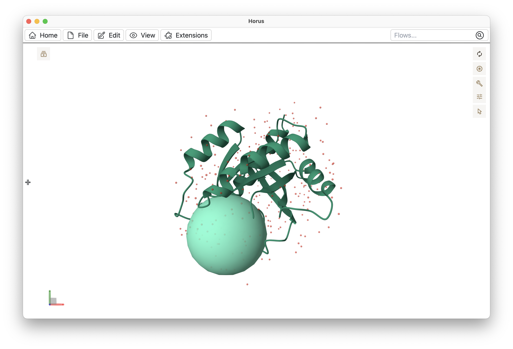

.. _molstar:

**************
Molstar (Mol*)
**************

Molstar is the molecular visualizer bundled with Horus. Mol\* is an open
source molecular visualizer written in TypeScript and WebGL. You can
find tutorials, documentation and the source code of Mol\* at https://molstar.org.

In order to control Mol\* from Horus, we use the :bdg-secondary-line:`MolstarAPI`, a bridge
built for communicating :bdg-secondary-line:`Blocks` with the molecular visualizer.

MolstarAPI
==========

MolstarAPI is a library for creating and manipulating molecular structures in the embedded Mol\* visualizer inside Horus.
It is designed to be used within :bdg-secondary-line:`Blocks` in order to add, visualize or edit
molecular structures.

In order to control the molecular visualizer within a :bdg-secondary-line:`Block` action, you need to import the
:bdg-secondary-line:`MolstarAPI` class and use the desired methods.

.. code-block:: python

    from HorusAPI import MolstarAPI

    # Loading a structure is simple
    my_pdb_file = "/path/to/1crn.pdb"
    molecule_name = "1crn crystal structure"

    MolstarAPI().addPDB(my_pdb_file, molecule_name)

    # So is loading a trajectory
    my_topology = "/path/to/topology"
    trajectory = "/path/to/trajectory"

    MolstarAPI().loadTrajectory(my_topology, trajectory)

Mol* actions will be stored in the :bdg-secondary-line:`flow` and applied to the canvas in the
order they were invoked. If a flow is not yet open, the actions will queue and execute once it opens.
The flow is then saved with the updated Mol* state.

Selections and Theming
=======================

MolstarAPI provides advanced selection and theming options through the following models and enums.

Selection Types
---------------

Selections can be made using different languages such as VMD, PyMOL, Jmol, or MolScript:

.. code-block:: python

    selection = MolecularSelection(script="resid 50 to 100", language=SelectionLanguage.VMD)

You can also use structured selections:

.. code-block:: python

    selection = MolecularSelection(chain="A", residue_range={"start": 50, "end": 100})

Themes
------

Example: Apply a cartoon representation colored by chain ID and with uniform sizing:

.. code-block:: python

    theme = MolstarThemeOptions(
        representation=MolRepresentations.CARTOON,
        color=ColorTheme.chain_id,
        size=SizeTheme.uniform
    )

Proximity Selections
--------------------

Select all atoms within a certain distance from another selection:

.. code-block:: python

    near_ligand = MolecularSelection(
        within_distance={
            "radius": 5.0,
            "target": MolecularSelection(residue=150)
        }
    )

Examples
========

.. code-block:: python

    from horus.api import MolstarAPI
    from horus.extensions.molstar.model import (
        MolstarThemeOptions,
        MolRepresentations,
        MolecularSelection,
        ColorTheme,
        SizeTheme,
    )

    # Load a molecule using cartoon representation
    label = "1abc"
    filePath = "/path/to/1abc.pdb"
    MolstarAPI().addMolecule(
        filePath,
        label=label,
        theme=MolstarThemeOptions(
            representation=MolRepresentations.CARTOON,
        ),
    )

    # Highlight a specific residue using ball-and-stick representation
    MolstarAPI().addComponent(
        label,
        "Very cool residue",
        selection=MolecularSelection(chain_and_residue={"chain": "A", "residue": 25}),
        theme=MolstarThemeOptions(
            representation=MolRepresentations.BALL_AND_STICK,
            color=ColorTheme.uniform,
            colorParams={
                "value": "red" # You can set X11 color names (yellow, red, blue, aliceblue...) or use a HEX color (i.e. #FF0000)
            },
            size=SizeTheme.physical,
            sizeParams={"scale": 2},
        ),
    )

    # Highlight a residue range with a surface representation and uncertainty coloring
    MolstarAPI().addComponent(
        label,
        "A range of cool residues",
        selection=MolecularSelection(script="resid 10 to 22", language=SelectionLanguage.VMD),
        theme=MolstarThemeOptions(
            representation=MolRepresentations.MOLECULAR_SURFACE,
            color=ColorTheme.uncertainty,
            colorParams={"domain": [-15, 15]},
            size=SizeTheme.physical,
            sizeParams={"scale": 1.5},
        ),
    )

API Methods
===========

.. automodule:: src.molstar
    :members:
    :undoc-members:
