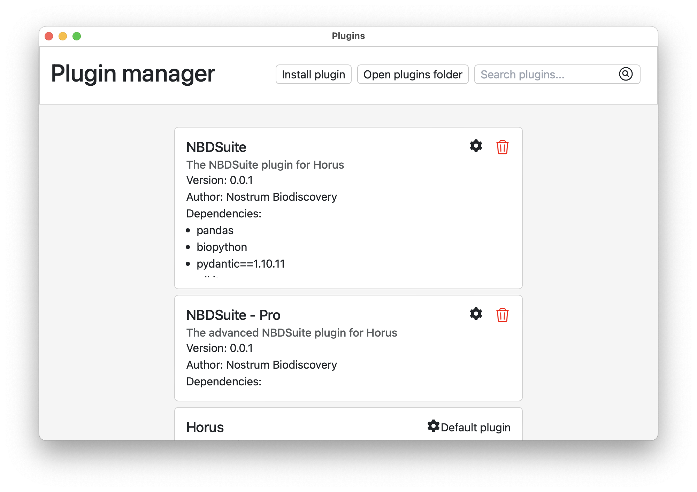

*******
Plugins
*******

Plugins are the way to extend Horus functionality. They are loaded when the app launches
and can be used to add new blocks, extensions or predefined flows to the app.

Creating a plugin
=================

To create a plugin, first create a folder with the name of the plugin and inside
it, add a file called :bdg-secondary-line:`plugin.meta`. This file contains
the metadata of the plugin in JSON format and it's used by Horus to load the plugin. Here's an
example of a plugin metadata file:

.. code-block:: json

    {
        "name": "Horus",
        "description": "Base plugin for Horus",
        "author": "Horus",
        "version": "0.0.1",
        "pluginFile": "Horus.py",
        "dependencies": []
    }

This is a JSON object that represents a plugin for the Horus app. The object contains the following properties:

- ``name``: The name of the plugin.
- ``description``: The description of your plugin.
- ``author``: The author of the plugin.
- ``version``: The version of the plugin.
- ``pluginFile``: The entry point of the plugin. This file must be located in the root of the plugin folder.
- ``dependencies``: An array of strings that contains the dependencies of the plugin. 

Dependencies of plugins
-----------------------

As you may know, Horus runs a python backend, which allows plugins to execute arbitrary python code. You can
include any Python library that is required for your Plugin to work. To include libraries in
your plugin, you must add them to the :bdg-secondary-line:`dependencies` array of the plugin metadata file. For example, if you want
to include pandas and matplotlib, your :bdg-secondary-line:`plugin.meta` file should look like this:

.. code-block:: json

    {
        "name": "My Plugin",
        "description": "A custom plugin",
        "author": "Foo",
        "version": "0.0.1",
        "pluginFile": "main.py",
        "dependencies": ["pandas", "matplotlib"]
    }

When the plugin is loaded, Horus will install the dependencies using :bdg-secondary-line:`pip`. If the dependencies are already installed,
Horus will skip the installation. In order for the dependencies to be installed, the computer where
Horus is running must have a valid :bdg-secondary-line:`python` interpreter installed. 

Deps folder: Some libraries are either not available in :bdg-secondary-line:`pip` or they are private. In this case, you can
embeed the library pre-installed with the plugin by adding the library to the :bdg-secondary-line:`deps` folder of the plugin. You can
also provide the packaged library and setting in the dependencies array the path to the library.
The :bdg-secondary-line:`deps` folder is located in the root of the plugin folder and is appended to the :bdg-secondary-line:`PYTHONPATH` variable
when the plugin is loaded.

.. warning::

    When importing a library in your python Plugin code, make sure to always import inside scoped functions. Libraries
    imported at top level may not work as the plugin gets automatically unloaded when not in use. This may result in
    the library being unloaded and the plugin not working as expected.

Code organization
-----------------

The code of the plugin should be located in the root of the plugin folder, but this is not mandatory. You can organize
some of the code inside a :bdg-secondary-line:`Include` folder. The only requirement is that the entry point of the plugin must be
located in the root of the plugin folder and must be named as the :bdg-secondary-line:`pluginFile` property of the plugin metadata file.
When running the plugin, the :bdg-secondary-line:`Include` folder is appended to the :bdg-secondary-line:`PYTHONPATH` variable.
Therefore, a more complex :bdg-secondary-line:`Plugin` folder structure can look like:

.. code-block:: bash

    MyPlugin
    ├── Include
    │   ├── __init__.py
    │   └── mymodule.py
    ├── deps
    │   └── numpy/ # Installed by pip
    ├── plugin.meta
    └── main.py

Then you can use the following statement in your :bdg-secondary-line:`main.py` file to import the :bdg-secondary-line:`mymodule.py` file:

.. code-block:: python

    from mymodule import MyModule

Coding the plugin
=================
In order to create a plugin we need to use the :bdg-secondary-line:`Plugin` class. This class is located in the :bdg-secondary-line:`HorusAPI` module. The only parameter needed for instantiating a plugin
is a custom unique ID. The plugin object must be instantiated to a global :bdg-secondary-line:`plugin` variable. For example:

.. code-block:: python

    from HorusAPI import Plugin

    plugin = Plugin("myplugin")

or from a function that returns the plugin object:

.. code-block:: python

    from HorusAPI import Plugin

    def get_plugin():
        return Plugin("myplugin")

    plugin = get_plugin()

Once you have instantiated your :bdg-secondary-line:`Plugin` object, you can start adding blocks and extensions to it. Please refer
to the :ref:`api-reference` section for more information about how to add blocks and extensions to your plugin using the :bdg-secondary-line:`Plugin` object.

Distributing plugins
====================

Once your plugin is ready, you can distribute it to other users. To do this, you have to create a zip file with the
contents of the plugin folder and then rename the :bdg-secondary-line:`.zip` extension to :bdg-secondary-line:`.hp`. Plugins can be installed in Horus
using the :bdg-secondary-line:`Install plugin` button in the :bdg-secondary-line:`Plugins` section of the app.

