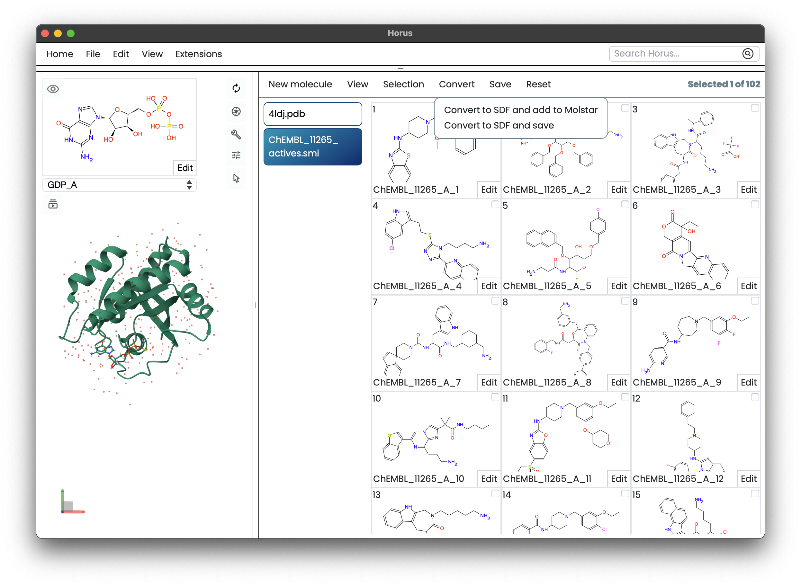

******
Smiles
******

SMILES (Simplified Molecular Input Line Entry System) is a notation that allows
a users to represent chemical structures in 2D notation. This notation can be used
in Horus.

In order to control SMILES from Horus blocks, we use the :bdg-secondary-line:`SmilesAPI`,
a bridge built for communicating :bdg-secondary-line:`Blocks` with the SMILES manager.

SmilesAPI
=========

SmilesAPI is a library for creating and manipulating molecular structures using 
SMILES notation in Horus. It is designed to be used within :bdg-secondary-line:`Blocks`
in order to add molecular structures represented by SMILES notation.

In order to control the SMILES interpreter within a :bdg-secondary-line:`Block` action, you need to import the :bdg-secondary-line:`SmilesAPI` class and use the desired methods.

.. code-block:: python

    from HorusAPI import SmilesAPI

    my_smiles = "CCCO"

    # Create the structure calling directly the Smiles API
    SmilesAPI().addSmiles(my_smiles)

The SMILES actions will be applied in the same manner as Mol* actions, for more information, refer to
the :ref:`molstar` documentation page.

SmilesAPI methods
------------------

.. automodule:: src.smiles
    :members:
    :undoc-members:
