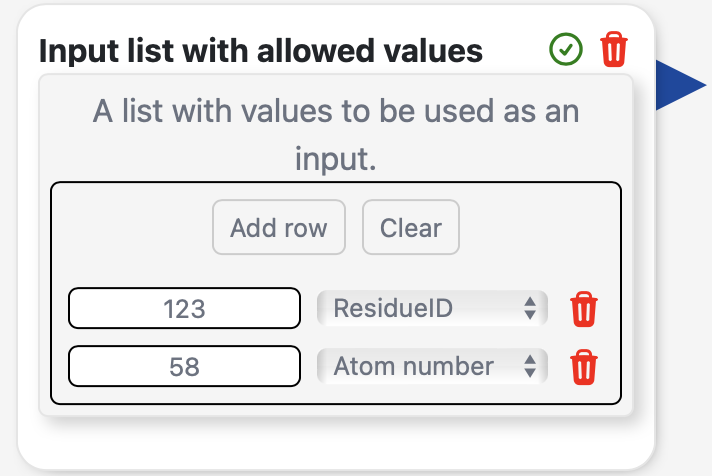
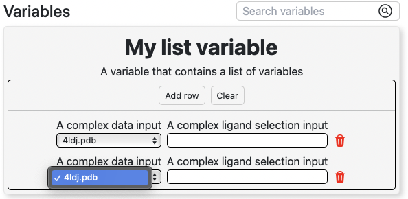

*********
Variables
*********

Usign variables in your :bdg-secondary-line:`Blocks` is very easy. Variables allow for the
interchange of information between the :bdg-secondary-line:`Flow` and the 
:bdg-secondary-line:`Action` of the blocks. Consider variables as parameters that the user
can modify during the build of the :bdg-secondary-line:`Flow`.

PluginVariable
==============

In order to define a variable that can be used in the :bdg-secondary-line:`Flow builder` you need to
instantiate the :bdg-secondary-line:`PluginVariable` class. This class has the following
parameters:

.. autoclass:: src.PluginVariable

For example, one may want to define a variable that allows the user to select a PDB
structure from the Mol* visualizer. This variable can be defined as follows:

.. code-block:: python

    structureVariable = PluginVariable(
        name="Structure",
        id="structure",
        description="Select a molecular structure from Mol*",
        type=VariableTypes.STRUCTURE,
    )

VariableTypes
=============

It is important to correctly define the type of our :bdg-secondary-line:`PluginVariables`. The available types are
defined in the :bdg-secondary-line:`VariableTypes` class:

.. autoclass:: src.VariableTypes
    :members:

For array types, such as :bdg-secondary-line:`STRING_LIST`, you need to specify
the allowed values in the :bdg-secondary-line:`allowedValues` parameter. For example:

.. code-block:: python

    favoriteColor = PluginVariable(
        name="Favorite color",
        id="favcolor",
        description="Select your favorite color",
        type=VariableTypes.STRING_LIST,
        allowedValues=["Red", "Green", "Blue"],
    )

For the :bdg-secondary-line:`LIST` type, you can specify the type of the elements of the list
using the :bdg-secondary-line:`allowedValues` parameter. For example:

.. code-block:: python

    inputlistWithAllowedValues = PluginVariable(
        name="Residue indices",
        id="values",
        description="A list with values to be used as an input.",
        type=VariableTypes.LIST,
        allowedValues=["ResidueID", "Ligand selection", "Atom number"],
    )

This will render a two-column table in the :bdg-secondary-line:`Flow builder` with the first column
containing the value and the second column containing a dropdown menu with the allowed values as the :bdg-secondary-line:`type`
which corresponds to the :bdg-secondary-line:`allowedValues` parameter.

The variable returns an array of the form: [value1, value2...] but when providing :bdg-secondary-line:`allowedValues` the
values are returned as a dictionary array of the form: [{"type": "allowedValue1", "value": value1}, {"type": "allowedValue2", "value": value2}...].

VariableGroup
=============

Variables can be grouped together using the :bdg-secondary-line:`VariableGroup` class. This is intended for
:bdg-secondary-line:`Blocks` that work with different sets of inputs. 

.. autoclass:: src.VariableGroup

For example, a PELE simulation
may require the input data for the protein and the ligand, which can be grouped together in a complex or separated
in their respective files. In this case, the :bdg-secondary-line:`VariableGroup` class can be used to group
these two different types of inputs:

.. code-block:: python

    ligandFileInput = VariableGroup(
        id="ligandFileInput",
        variables=[
            system_data_input,
            ligand_data_input_file,
        ],
    )

    ligandSelectionInput = VariableGroup(
        id="ligandSelectionInput",
        variables=[
            complex_data_input,
            complex_ligand_selection_input,
        ],
    )

The :bdg-secondary-line:`VariableGroup` class has then to be assigned to the :bdg-secondary-line:`inputGroup` parameter of a :bdg-secondary-line:`Block`.

When running a :bdg-secondary-line:`Block` action, the selected group can be accessed using the :bdg-secondary-line:`selectedInputGroup` property of the :bdg-secondary-line:`Block` class:

.. code-block:: python

    def blockAction(block: SlurmBlock):
        
        selectedGroup = block.selectedInputGroup # Either "ligandFileInput" or "ligandSelectionInput" in our example

:bdg-secondary-line:`VariableGroup` can also be assigned to a regular :bdg-secondary-line:`Block` variable. In this case, the
returned value will be a dictionary with the ids of the variables as keys and the values as values. For example:

.. code-block:: python

    myObjectVariable = VariableGroup(
        id="myObjectVariable",
        name="My object variable",
        description="A variable that contains a group of variables",
        variables=[
            complex_data_input,
            complex_ligand_selection_input,
        ],
    )

    def blockAction(block: SlurmBlock):
        
        value = block.variables["myObjectVariable"] # {"complex_data_input": "complex.pdb", "complex_ligand_selection_input": "LIG"}

On render, the variable groups appear as regular :bdg-secondary-line:`PluginVariable`, but with the inner variables grouped together.

VariableList
=============

Besides from the simple :bdg-secondary-line:`VariableTypes.LIST` type, there is also the :bdg-secondary-line:`VariableList` class. 

.. autoclass:: src.VariableList

This class offers more flexibility. In the case of :bdg-secondary-line:`VariableTypes.LIST`, only string values, along with an optional dropdown for :bdg-secondary-line:`allowedValues`
is available. :bdg-secondary-line:`VariableList` allows for the definition of a list of variables of any type. For example:

.. code-block:: python

    myListVariable = VariableList(
        id="myListVariable",
        name="My list variable",
        description="A variable that contains a list of variables",
        prototypes=[
            complex_data_input, # VariableTypes.STRUCTURE
            complex_ligand_selection_input, # VariableTypes.STRING
        ],
    )

Notice the :bdg-secondary-line:`prototypes` parameter. This parameter defines the variables that will be used in the list. On render, it will show like this:

