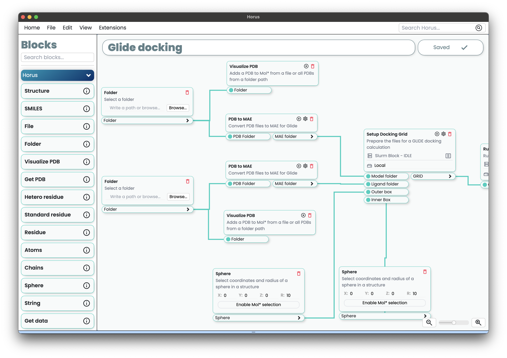

***************
Developer guide
***************

|Product| is the main interface that allows users, developers and researchers to create custom plugins, blocks and extensions for Horus.

Introduction
============

The most fundamental element of Horus are :bdg-secondary-line:`Plugins`, which are modules that add funcctionality to the app. Plugins contain :bdg-secondary-line:`Blocks`, which represent a single task. :bdg-secondary-line:`Blocks` can be configured to run
arbitrary python code, thus allowing the user to create custom tasks. Examples of :bdg-secondary-line:`Blocks`
include PDB preparation, folder structure creation, submission of jobs to a cluster, unzipping files, etc.
An index of all the :bdg-secondary-line:`Blocks` that Horus implements by default can be found in the section
:ref:`default` section.

:bdg-secondary-line:`Blocks` can be connected to each other throught :bdg-secondary-line:`Variables` and are meant to be run in a :bdg-secondary-line:`Flow`. 
Any block can be run as a standalone task, but the real power of Horus comes from the ability to chain blocks together in a :bdg-secondary-line:`Flow`.

In addition to :bdg-secondary-line:`Flows`, |Product| also has a feature
called :bdg-secondary-line:`Extensions`, which allows developers to build custom views to represent any data using standard web technologies such as HTML, CSS and Javascript.

Usage
=====

.. toctree::
    :caption: Getting started
    :maxdepth: 1

    installation.rst

.. toctree::
    :caption: Building a plugin
    :maxdepth: 2

    horusapi/plugins.rst
    horusapi/variables.rst
    horusapi/blocks.rst
    horusapi/extensions.rst
    horusapi/flows.rst

.. toctree::
    :caption: RemotesAPI
    :maxdepth: 2

    horusapi/remotes.rst

.. toctree::
    :caption: MolstarAPI
    :maxdepth: 2

    horusapi/molstar.rst

.. toctree::
    :caption: SmilesAPI
    :maxdepth: 2

    horusapi/smiles.rst

.. |Product| replace:: HorusAPI