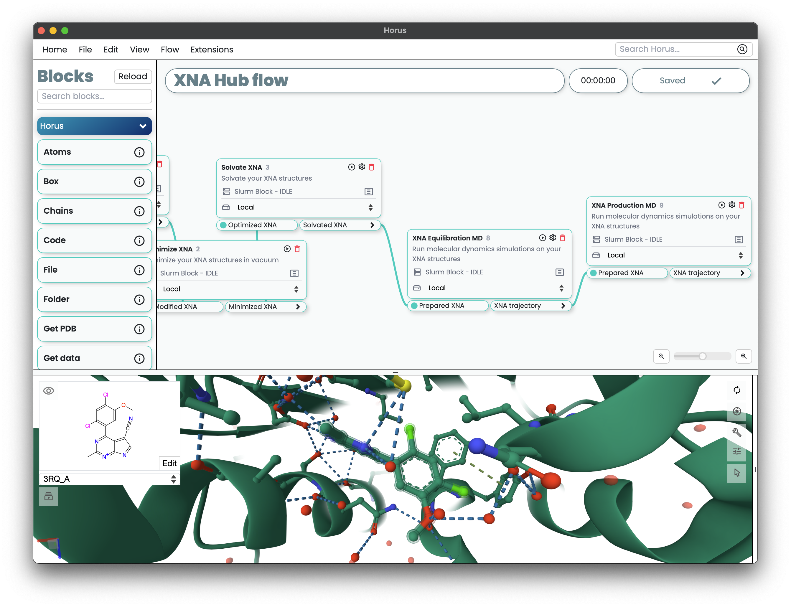

Introduction to Horus
=====================

What is Horus?
--------------

:bdg-secondary-line:`Horus` is an innovative multi-platform GUI which empowers scientists in areas such as molecular modelling.
Leveraging cutting-edge technologies, it can serve as a local application or as a centralized server for
collaborative teamwork. Integrated with a 2D infinite canvas, :bdg-secondary-line:`Horus` excels as a modular workflow designer
across different environments. Its autonomous blocks enable seamless linking, facilitating customizable and
distributable workflows via an accessible API.

Downloading and installing Horus
================================

You can download :bdg-secondary-line:`Horus` for Linux and macOS from the Barcelona Supercomputing Center webpage: `horus.bsc.es/download <https://horus.bsc.es/download>`_.

macOS Installation
------------------

For macOS, the installation is straightforward:

1. Download the appropriate dmg file for your system (Intel or Apple Silicon) from `horus.bsc.es/download <https://horus.bsc.es/download>`_.
2. Open the dmg file and drag & drop the :bdg-secondary-line:`Horus` application into your Applications folder.

Linux Installation
------------------

For Ubuntu 22 and Up
^^^^^^^^^^^^^^^^^^^^

This version contains a windowed GUI application and requires GTK to be installed in your system.

1. Download the .deb file from `horus.bsc.es/download <https://horus.bsc.es/download>`_.

2. Open a terminal and navigate to the directory where the .deb file is located.

3. Install the .deb file using the following command:

.. code-block:: bash

   sudo dpkg -i horus-ubuntu22.deb

For Other Linux
^^^^^^^^^^^^^^^^

This version does not contain the GTK webview due to incompatibility but can be run in server mode (learn more in the :ref:`running` section).
It is intended for older or other versions of Linux.

1. Download the compiled folder from `horus.bsc.es/download <https://horus.bsc.es/download>`_.

2. Extract the folder to your desired location.

3. Open a terminal and navigate to the extracted folder.

4. Execute :bdg-secondary-line:`Horus` using the following command:

.. code-block:: bash

   ./Horus --help

Windows
-------

Windows compatibility is not available. In order to run :bdg-secondary-line:`Horus` using a Windows machine,
you can use a virtualization framework like `WSL <https://learn.microsoft.com/en-us/windows/wsl/install>`_ or running :bdg-secondary-line:`Horus` in a remote Linux machine
and then connecting through your browser. More information regarding :bdg-secondary-line:`Server mode` is available in the :ref:`running` section.

Other systems
-------------

If you encounter issues running :bdg-secondary-line:`Horus` in other Unix based systems, do not hesitate to contact the developers of Horus at `christian.dominguez@bsc.es <christian.dominguez@bsc.es>`_