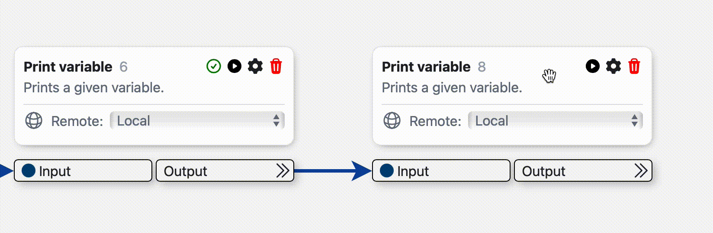
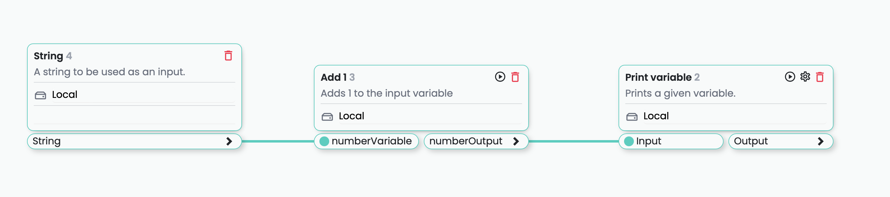
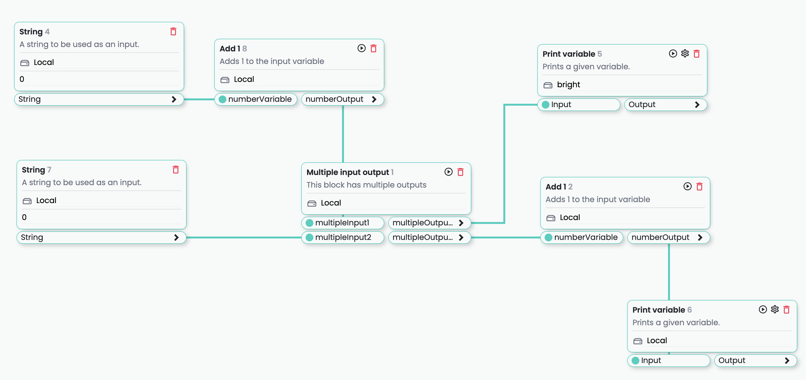
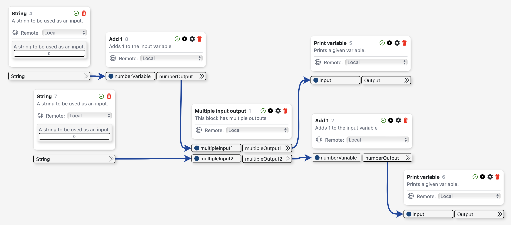
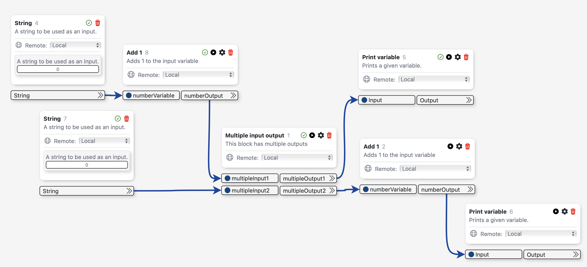
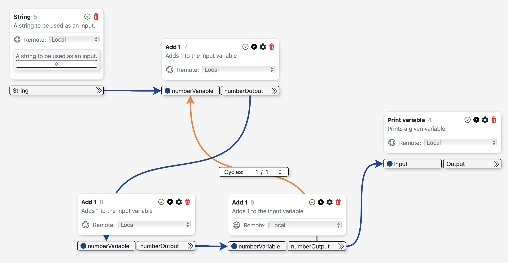

************
Runing flows
************

The main feature of |ProductName| is the ability to run custom flows that can be created by the user in an
infinite 2D canvas. The flows are composed of blocks that can be connected to each other through variables.
Due to the complex nature of the flows, there are rules that must be followed in order to correctly run them.
In this section we will explain how to correctly run a flow and what are the rules that must be followed.

The execute block button
========================

The :bdg-secondary-line:`Execute block` button is the main button that is used to run a flow. It is located in the placed block view and it
is represented by a play icon. When the user clicks on the play button, the block that is currently selected will
be executed. 

Basic Usage
-----------

When running a block that is connected to other blocks, the flow will run first the input blocks that are connected
and then the selected block. If the input blocks are already run, they will return the output instead of running.
Then, it will run the next blocks wich are connected to the output variables of the selected block.

Reset flow and execute block
----------------------------

When pressing the :bdg-secondary-line:`Ctrl` (on macOS :bdg-secondary-line:`⌘`) key, the play block button will change to a "Reset flow and execute block" button.
This will reset the flow (clear outputs of blocks) an run the selected block. Consequently, the flow will run all the blocks that are connected to the selected block.

Types of flows
==============

Due to the complex nature of having an infinite 2D canvas, there are different types of flows that can be created.
The type of flow depends on the way the blocks are connected to each other. Currently, |ProductName| supports
three types of flows: 

- Branch-less flows
- Branched flows
- Cyclic flows

Branch-less flows
-----------------

The easiest type of flows are those which consist of a single, straight line of chained blocks. These flows
are called branch-less flows and they are the easiest to run because of its simple nature. In order to run
a branch-less flow, the user can select any block in the flow and click on the :bdg-secondary-line:`Execute block`
button in the block view. This will execute the selected block and all the blocks that are connected to it. If the 
blocks are already run, they will return the output instead of running, but if the "Reset flow and execute block" button
is pressed, then the blocks will be run again and the outputs will be overwritten.

Branched flows
--------------

Branched flows are those in which one or more blocks accept more than one input or have more than one output. This branching
allows the user to create more complex flows. When running a branched flow the user must take into account the following
rules, which are easily explained with the following flow as an example:

.. warning::
    
        When a single output is connected to multiple inputs, the first block to be executed will be the one that was first
        connected to the output. In order to change the order of execution, the user must disconnect the blocks and connect
        them again in the desired order.

Running from an early block
~~~~~~~~~~~~~~~~~~~~~~~~~~

- When running the branched block from an early block, all of the inputs requested for another block will be run.

All the outputs of the following blocks will be run, which means that all of the branches **AFTER** the selected block
will be run. In the following example the "Add 1" block with placedID = 8 was selected for execution. As you can see,
all of the blocks in the flow were run, even the ones that are not directly connected to the selected block. "String" block
with placedID = 7 was run because of an input request from the "Multiple input output" block with placedID = 1. Then, the
two branches coming of the "Multiple input output" block were run.

Running from a later block
~~~~~~~~~~~~~~~~~~~~~~~~~~

- When running a branched block from a later block, only the inputs requested for another block will be run.

If an earlier block which is executed as request of the selected block has more than one output, only the output that is
directly in line with the selected block will be run. In the following example, after selecting block "Print
variable" with placedID = 5 to be executed, only the needed blocks to execute that branch were run. The second branch coming out from
the "Multiple input output" block with placedID = 1 was not run because it was not needed in order to run the initial selected block.

Cyclic flows
------------

Cyclic flows are those in which the flow order is not linear and cycles through the same blocks more than once. This type of flows
are the most complex to run because of the nature of the cycles. In order to run a cyclic flow, the user must take into account the
following rule:

- Cyclic flows will only run the cycles when the selected block to run is placed **BEFORE** the cycle.
- If the selected block to run requests an input from a block that is in a cycle, the cycle will be skipped entirely.

In the following example, if the user selects to execute the "Add 1" block with placedID = 7, the flow will run the "String" block
and then it will execute the next blocks accounting for the cycle. In this case, the output of the flows is "6".

If the user selects to execute the "Print variable" block with placedID = 4, the cycle will not be executed and the output of the
flow will be "3".

.. |ProductName| replace:: Horus